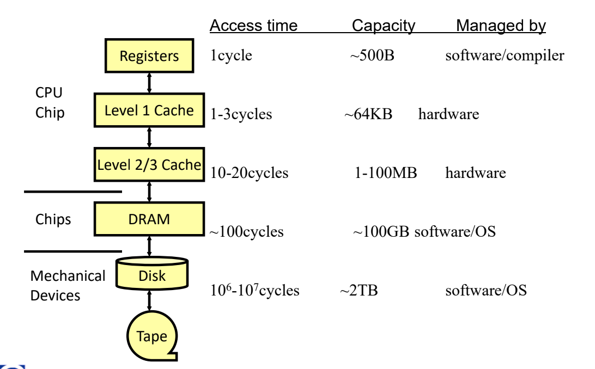
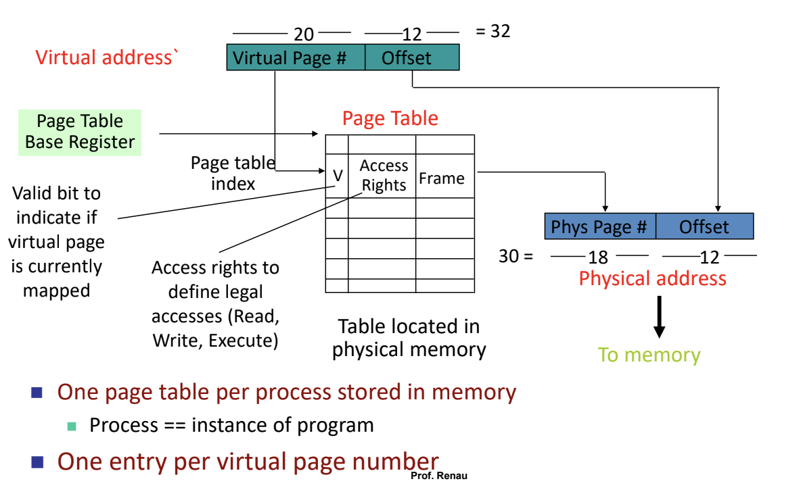
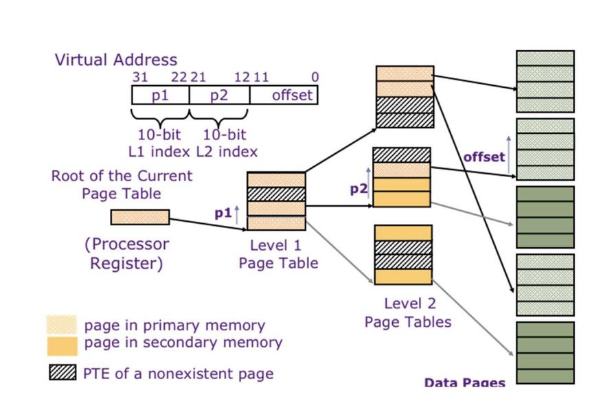

Memory
======

- Static RAM (SRAM)
    - 20MB/chip, 0.2-2.5ns, >$100/GB
- Dynamic RAM (DRAM)
    - 500MB/chip, 50-70ns, ~$5/GB
- Flash (non-volatile)
    - 16GB/chip, 20us-5ms, ~$0.50/GB
- Magnetic Disk (nonv, mechanical)
    - >1TB/disk, 5-20ms, $0.05/GB

Big mems are cheap but slow, and small mems are fast but expensive

so we need a memory hierarchy!

- Store everything on a slow mem
- Copy recently accessed & nearby data to smaller DRAM memory
    - DRAM is called main memory
- Copy more recently accessed & nearby data to smaller SRAM memory
    - Called the cache

Terminology
-----------
- Hit – accessed data found at “upper” level
    - hit rate: fraction of accesses to upper level that finds the data
    - hit time: time to access data on a hit

- Miss: accessed data found at “lower” level of the hierarchy
    - processor typ. waits until block fetched into upper level
    - miss rate: 1 – hit rate
    - miss penalty: time to get block from lower level and satisfy request

- local hit rate vs global hit rate

- hit time << miss penalty

Locality
--------

- principle of locality
    - programs work on a relatively small portion of data at any time
    - can predict data accessed in the near future by looking at recent accesses

- temporal locality
    - if an item has been referenced, it will probably be referenced again soon
    - probability of accessing A again at time t+x highest as x approaches 0

- spatial locality
    - if an item has been accessed, nearby items will tend to be referenced soon
    - probability of accessing A+x at time t highest as x approaches 0

Caches
------

- holds recently referenced data
    - Functions as a buffer for larger, slower storage components
- Exploits principle of locality
    - Provide as much inexpensive storage space as possible
    - Offer access speed equivalent to the fastest memory
        - For data in the cache
        - Key is to have the right data cached
- Computer systems often use multiple caches
- Cache ideas are not limited to hardware designers
    - Example: Web caches widely used on the Internet

Questions
^^^^^^^^^
- Where can I store a particular piece of data? (mapping)
    - Direct mapped (single location)
    - Fully associative (anywhere)
    - N-way set associative (anywhere in a set of size N)
- What do I throw out to make room? (replacement policy)
- How much data to I move at a time? (block size or cache line size)
- How do we handle writes?
    - Bypass cache
    - Write thru the cache
    - Write into the cache – and then write back

Direct Mapped
^^^^^^^^^^^^^

- location in cache determined by main memory address
- cache address = (memory address) mod (cache size)
- but we need to remember what memory address is in a given cache slot
    - store the higher order bits "tag"
    - and also a valid bit in case the cache was never written to

.. code-block:: text

    31 30 .. 10 09 .. 02 01 00
    | Tag      | Index  | Offset

- cache hit if cache[index].tag == tag, cache[index].valid = 1

Set-Associative
^^^^^^^^^^^^^^^

- made up of multiple sets containing blocks
- e.g. a 2-way SA with 1024 blocks has 512 indices
- can handle same index, different tag
- use LRU to evict
- use a mux to determine which block in a set to pull data from based on which block hit

Stores
^^^^^^

- Write-thru: write data to all levels of memory
    - main memory updated on each cache write
    - replacing a cache entry is simple
    - memory write causes big delay
- Write-back: only write to cache
    - cache and main memory are different
    - add dirty bit to cache entry to indicate if cache data needs to be written to memory
    - replacing a cache entry requires writing data back to mem before replacement if dirty

Performance
-----------

.. math::

    AMAT = t_h + r_m * t_p

- AMAT = Average Memory Access Time
- :math:`t_h` = time (hit)
- :math:`r_m` = rate (miss)
- :math:`t_p` = time (penalty)

To improve, we can decrease miss penalty, decrease miss rate, or decrease hit time

AMAT can be thought of as the number of X cycles in loads

.. note::
    Time penalty is not the same as the round trip time - round trip time = :math:`t_h + t_p`!

Example
^^^^^^^
Assume:

- miss rate of instructions = 5%
    - affects all instructions - the F cycle
- miss rate for data = 8%
- data references per instruction = 0.4
- CPI with perfect cache = 1.4
- miss penalty = 20 cycles

- find performance relative to perfect cache
    - misses/instruction = 0.05 + (0.4 * 0.08) = 0.08
    - miss stall CPI = 0.08 * 20 = 1.6
    - new CPI = 1.4 + 1.6 = **3**

- Assuming hit time = 1
    - AMAT = 1 + 0.08 * 20 = **2.6**

Miss Penalty 1
^^^^^^^^^^^^^^
First option to optimize miss penalty: Fill Before Spill

- In writeback caches, if line is dirty on a r/w miss, need to write back
- this increases miss penalty because it needs to spill (writeback) before fill (new data)
- solution: spill dirty line into on-chip spill buffer, write that in background
    - only necessary if cache line is dirty

Miss Penalty 2
^^^^^^^^^^^^^^
2nd option: Early Restart

- decrease miss penalty with no new hardware, more complex control
- strategy: impatience
- no need to wait for the entire line to be fetched
- early restart: as soon as the requested word/dword from the cache block arrives, continue execution
    - rest of line in loaded in background
- if the CPU references another cache line or later word in the same line, stall

Miss Penalty 3
^^^^^^^^^^^^^^
Critical Word First

- improvement over early restart
    - request missed word first from memory system
    - send it to CPU as soon as it arrives
    - CPU consumes word while rest of line arrives
- even more complex control logic
    - needs to change memory system
    - block fetch must wrap around

Miss Penalty 4
^^^^^^^^^^^^^^
2nd-Level Caches

- add another level of cache between CPU and memory
    - invisible to CPU
    - allows L1 cache to be small and fast
    - L2 is slower but faster
- reduces overall miss penalty

.. math::

    AMAT = t_{hL1} + r_{mL1} * t_{pL1}

    t_{pL1} = t_{hL2} + r_{mL2} * t_{pL2}

    \therefore AMAT = t_{hL1} + r_{mL1} * (t_{hL2} + r_{mL2} * t_{pL2})

We measure the L2 miss rate differently:

- **local miss rate**: cache misses / cache accesses
- **global miss rate**: cache misses / CPU memory accesses (more useful)

Example: a CPU with 100,000 memory accesses has 3,000 L1 misses and 1,500 L2 misses
    - L1 cache local miss = L1 global miss = 3000/100000 = 3%
    - L2 local miss = 1500/3000 = 50%
    - L2 global miss = 1500/100000 = 1.5%

.. note::
    If the L2 miss rate > L1 miss rate, it has to be the local miss rate

Miss Rate 1
^^^^^^^^^^^
L2 Cache Design

- Speed of 2nd level cache affects only miss penalty not cpu clock
- Only 2 questions about 2nd-level design alternative
    - Will it lower the AMAT portion of the CPI?
    - How much does it cost?
- Size of 2nd level cache >> first level (decrease local MR)

Miss Rate 2
^^^^^^^^^^^
Adjust Block Size

- larger block size better exploits spatial locality
- but, larger block size = larger miss penalty (takes longer to transfer a miss)
    - if the block size is too big:
        - average access time goes up
        - overall miss rate can increase because temporal locality is reduced (less cache lines to increase line size)

Miss Rate 3
^^^^^^^^^^^
Cache Replacement Policies

- in set associative caches, which line do you replace?
    - random replacement
    - not MRU
    - random + not MRU
    - LRU
        - for 2-way, same as not MRU
    - lots of other options

Miss Rate 4
^^^^^^^^^^^
Hardware Prefetching

- a technique to improve cold and capacity misses
- have hardware fetch extra lines on a miss
    - can store in cache or separate stream buffer
- disadvantages:
    - hardware always prefetches
    - scheme relies on excess available memory bandwidth
    - can hurt performance if it interferes with demand misses

Hit Time 1
^^^^^^^^^^
Small, Simple Caches

- on many modern machines, AMAT is the bottleneck on CPI
- index portion of address compares to cache tag, comparison is slow
- simpler caches have better hit times

Virtual Memory
--------------
Used to improve security or to simulate greater access space

- Programs see virtual addresses
- real (physical) addresses seen outside of CPU
- shared memory: two applications use same physical memory

Translation
^^^^^^^^^^^

- page size varies with architectures
    - 4K (typical), 8K, 16K, ...

.. code-block:: text

    [ VPN ... | Offset ]

    becomes

      [ PPN.. | Offset]

Translate Virtual Page Number to Physical Page Number, don't touch offset

Physical address space is usually way smaller than the virtual address space

Linear Page Table
"""""""""""""""""
The page table takes a VPN and gives a PPN plus some metadata

- this doesn't really scale well

Page Table
""""""""""

Page Faults
"""""""""""
Hardware indicates an exception that notifies the OS to do something

Hierarchical Page Table
"""""""""""""""""""""""

TLB
"""
Translation Lookaside Buffer

- hardware translation to speedup translation
- typically 32-128 entries
- kinda like a cache
- on a miss, either software exception or hardware page traversal allocate

**Variable Size TLB**

Add a bit to track when translating VPN-PPN of what size pages to use

**TLB Entries**

- each TLB entry stores a Page Table Entry
- includes things like physical page numbers, permission bits, other info like a dirty bit, etc
    - maybe a PID so that you don't have to flush TLB when switching process contexts

- tag: portion of the virtual page # not used to index TLB
- valid bit
- LRU bits, if associative TLB

Virtual Caches
^^^^^^^^^^^^^^

Option 1: index all the caches using virtual addresses
    - low overhead, TLB can be slow/big, but requires a cache flush on context change
    - not common

Physical Caches
^^^^^^^^^^^^^^^

Option 2: translate all the accesses to physical
    - no problem with sharing
    - but adds 1 cycle to cache hit time

Virtually-Indexed/Physically-Checked Cache
^^^^^^^^^^^^^^^^^^^^^^^^^^^^^^^^^^^^^^^^^^

- virtually indexed L1
    - but virtual index needs to be the same as physical index!
    - index size must be smaller than page size
- L1 tags used physical addresses
    - hit is determined if tag PA = VA PA
- L2 cache uses physical addresses
- good sharing, no extra overhead
- but hard to design